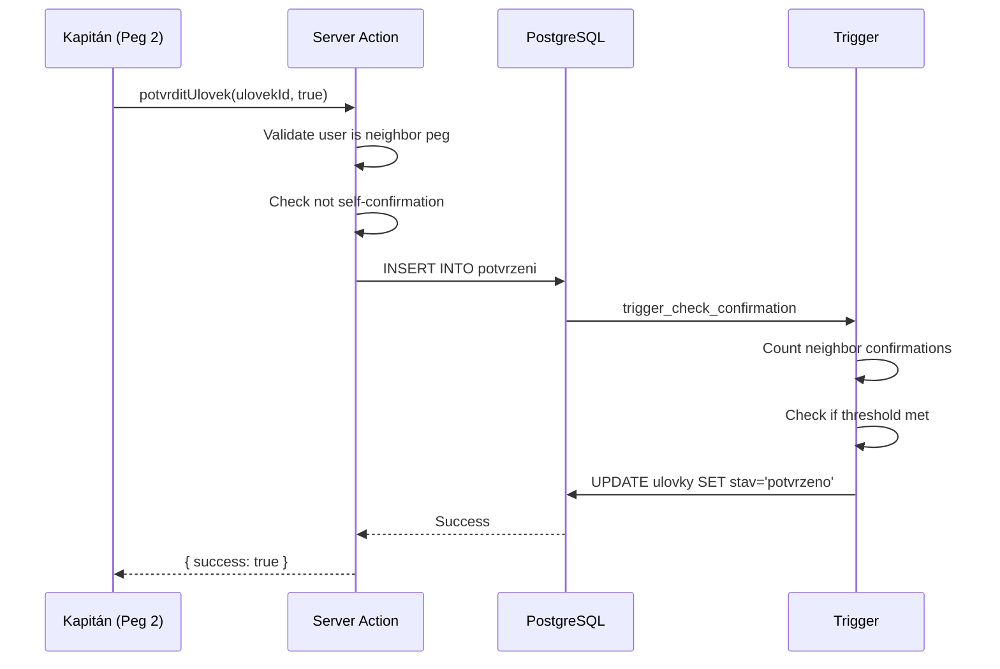

# Checkpoint 9: Potvrzování (Confirmation System)

## Status: ✅ PASSED

## Verification Date
January 2, 2026

## Requirements Validated

| Requirement | Description | Status |
|-------------|-------------|--------|
| 4.2 | Neighbor peg captain can confirm catches | ✅ |
| 4.3 | Both neighbors must confirm for middle pegs | ✅ |
| 4.4 | Referee/organizer can confirm any catch | ✅ |
| 4.5 | Edge pegs need only one neighbor | ✅ |
| 4.6 | Cannot confirm own team's catch | ✅ |

## Components Verified

### 1. Permission Functions (`src/lib/permissions.ts`)

- `canConfirmUlovek()` - Correctly validates who can confirm catches
  - Rozhodci/Poradatel can confirm any catch
  - Kapitan can only confirm neighbor pegs (|diff| = 1)
  - Zavodnik and Divak cannot confirm

- `isSelfConfirmation()` - Correctly detects self-confirmation attempts

### 2. Server Action (`src/actions/potvrzeni.actions.ts`)

- `potvrditUlovek()` - Handles confirmation workflow
  - Validates user authentication
  - Checks catch status (must be 'ceka')
  - Validates neighbor peg relationship
  - Prevents self-confirmation
  - Inserts confirmation record
  - Rozhodci confirmation immediately updates catch status

- `getPendingPotvrzeni()` - Returns catches awaiting confirmation
  - Filters by neighbor pegs for kapitans
  - Shows all pending for rozhodci/poradatel
  - Excludes already confirmed catches

### 3. Database Trigger (`supabase/migrations/003_functions_triggers.sql`)

- `check_ulovek_confirmation()` trigger:
  - Counts confirmations from neighbor pegs
  - Edge pegs (first/last) require 1 confirmation
  - Middle pegs require 2 confirmations
  - Rozhodci confirmation immediately confirms catch
  - Updates `ulovky.stav` to 'potvrzeno' when threshold met

### 4. RLS Policies (`supabase/migrations/002_rls_policies.sql`)

- `potvrzeni` table policies:
  - Everyone can read confirmations
  - Only neighbor pegs or rozhodci/poradatel can insert
  - Self-confirmation prevented at database level

## Test Results

### Unit Tests (26 tests)
```
✓ src/lib/__tests__/permissions.test.ts (26 tests)
  ✓ canConfirmUlovek (6 tests)
  ✓ isSelfConfirmation (2 tests)
```

### Checkpoint Verification (17 tests)
```
✓ Neighbor pegs can confirm
✓ Non-neighbor pegs cannot confirm
✓ Rozhodci/Poradatel can confirm any catch
✓ Self-confirmation is detected and blocked
✓ Zavodnik/Divak cannot confirm
✓ Edge peg logic works correctly
✓ Database trigger logic verified
```

## Confirmation Flow



## Edge Cases Handled

1. **Edge Pegs (First/Last)**: Only require 1 confirmation
2. **Middle Pegs**: Require 2 confirmations (both neighbors)
3. **Rozhodci Override**: Can confirm any catch immediately
4. **Self-Confirmation**: Blocked at both server action and RLS level
5. **Already Confirmed**: Returns error if catch already confirmed
6. **Duplicate Confirmation**: Prevented by unique constraint

## Files Modified/Created

- `scripts/verify-potvrzeni-checkpoint.ts` - Verification script
- `docs/potvrzeni-checkpoint.md` - This documentation

## Next Steps

Proceed to Task 10: Server Actions - Leaderboard
